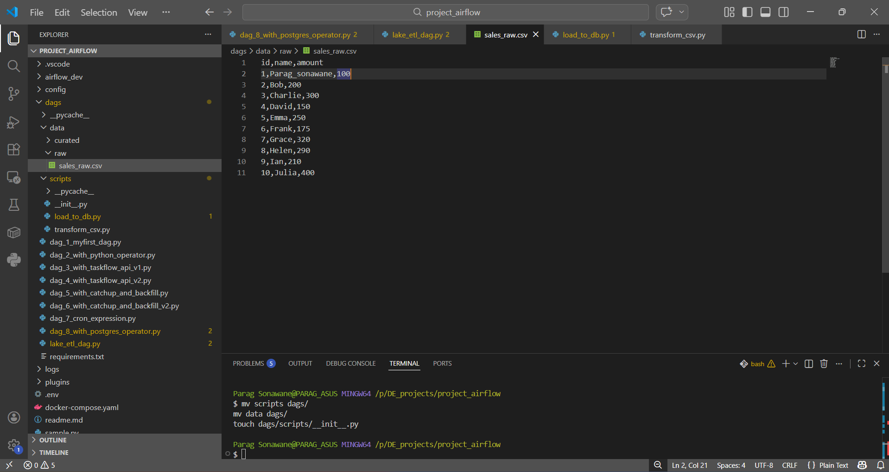
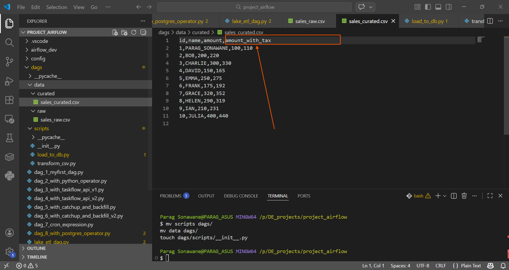
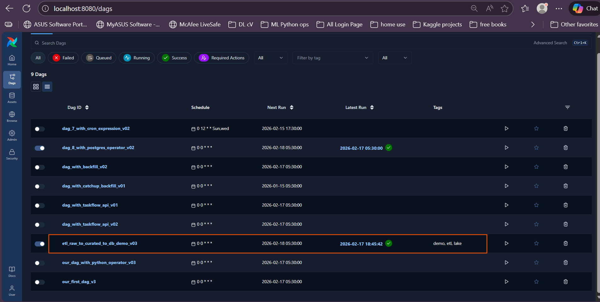
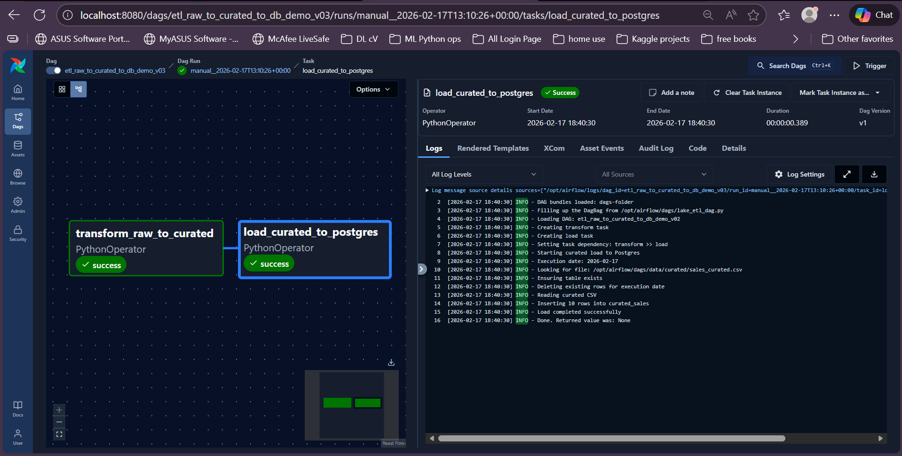
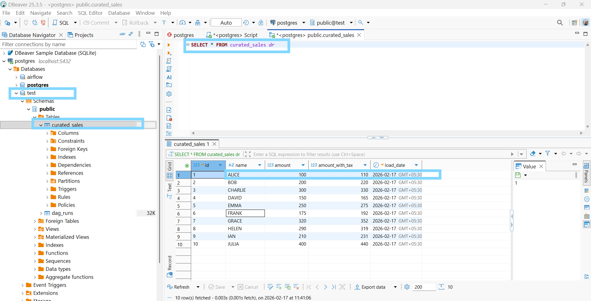
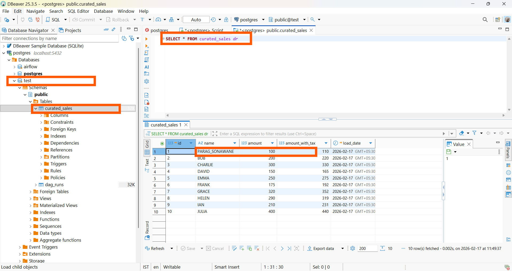

# Airflow-ETL-Demo (Python + SQL, Docker)

This is a small hands-on ETL project built to practice Apache Airflow orchestration, Python-based data transformation, and PostgreSQL loading using a local Docker setup.

Instead of using Spark or large-scale infrastructure, this project focuses on core ETL concepts, workflow design, modular scripting, and reproducible local execution.

In production environments, the DAG folder should contain only workflow code, while datasets should be stored in external locations such as `/data`, object storage (e.g., S3), or data lake paths.  
For this demo project, sample data is intentionally kept inside the repository to reduce dependencies and keep the setup simple for local execution.

---

## Overview

The pipeline follows a simple data lake style flow:

RAW CSV → Transform with Python → CURATED CSV → Load into PostgreSQL

* Input CSV files are placed in the **raw** folder
* Airflow runs a Python script to clean and transform the data
* The processed file is saved in the **curated** folder
* A downstream task loads the curated data into PostgreSQL
* DBeaver is used to verify tables and query results

The load step is implemented to be **idempotent**, so rerunning the DAG does not create duplicate records.

---

## Project Structure

```
dags/
 ─ lake_etl_dag.py              # Main Airflow DAG
 ─ scripts/
     ─ transform_csv.py         # Raw → curated transformation
     ─ load_to_db.py            # Curated → PostgreSQL load

data/
 ─ raw/                         # Input CSV files
 ─ curated/                     # Transformed output files

docker-compose.yaml
README.md
```

---

## Airflow Concepts Demonstrated

* DAG creation and cron scheduling
* PythonOperator task execution
* PostgreSQL connection usage from Airflow
* Idempotent ETL pipeline design
* Catchup and historical run handling
* Fully containerized Airflow environment with Docker

---

## How to Run Locally

1. Start containers:

```
docker compose up -d
```

2. Open Airflow UI:

```
http://localhost:8080
```

3. Ensure the PostgreSQL connection exists in Airflow
   (example: `postgres_default` or your configured connection).

4. Place a sample CSV inside:

```
data/raw/
```

5. Enable and trigger the DAG from the Airflow UI.

6. Verify results in PostgreSQL (via DBeaver):

```sql
SELECT * FROM sales_curated;
```

---
7. postgres port :Verify results in PostgreSQL (via DBeaver):
'''
http://localhost:5432 
'''

## Purpose

This project was created as an initial step toward Data Engineering , focusing on:

* Understanding Airflow orchestration in practice
* Integrating Python processing with SQL-based storage
* Structuring raw and curated data layers
* Building pipelines that are safe to rerun

Future improvements may include object storage integration (S3/MinIO), validation steps, logging enhancements, and Spark-based transformations for larger datasets.

---

This repository represents a foundational Data Engineering practice project and will be extended incrementally.


## Screenshots

### Raw CSV Data


### Curated CSV Data


### Airflow DAG Running


### Airflow DAG Graph View


### Before Update Name


### After Update Name

